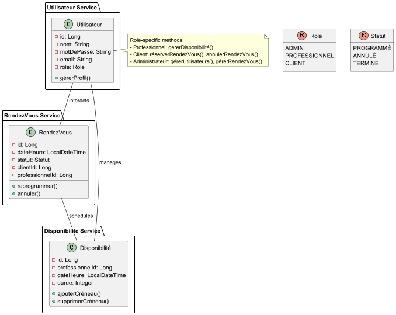
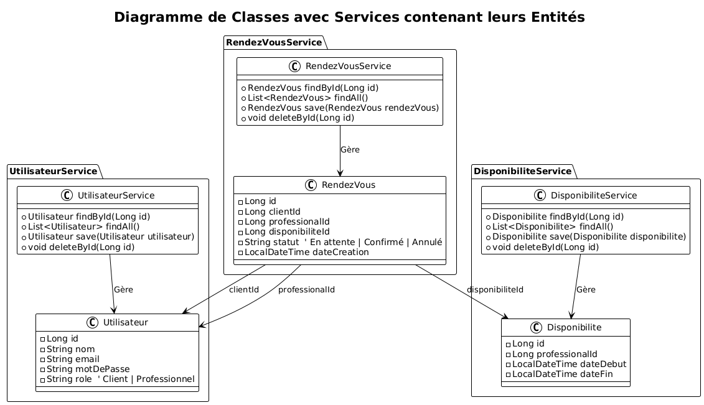
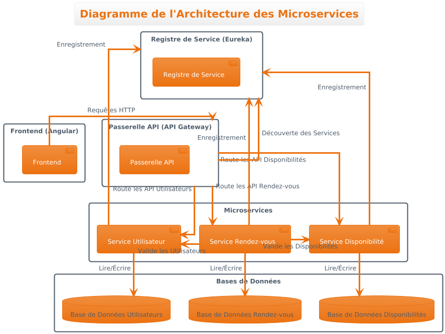

# **Architecture des Microservices**
Ce projet utilise une architecture de microservices pour organiser les fonctionnalités principales en trois services distincts :

**Service Utilisateur** : Gère les données et opérations des utilisateurs (clients, professionnels).
**Service RendezVous** : Gère la planification et le suivi des rendez-vous entre clients et professionnels.
**Service Disponibilité** : Gère les créneaux de disponibilité pour les professionnels.
## **Détails des Services**
### Service Utilisateur
Le Service ***Utilisateur*** gère les informations des utilisateurs, y compris l'inscription, l'authentification et les rôles (Client, Professionnel).

### Service RendezVous
Le Service ***RendezVous*** est responsable de la création, mise à jour et annulation des rendez-vous entre clients et professionnels.

### Service Disponibilité
Le Service ***Disponibilité*** permet aux professionnels de définir et gérer leurs créneaux horaires disponibles pour les rendez-vous.

# Diagramme de classes (conception)
Voici le diagramme de classes utilisé pour ce projet :

# Diagramme de classes (implémentation)
Voici le diagramme de classes utilisé pour ce projet :

# Diagramme des microservices
Voici le diagramme des microservices utilisé pour ce projet :

# Test des endpoints:

### Utilisateur Endpoints Test:

### RendezVous Endpoints Test:

### Disponibilité Endpoints Test:

